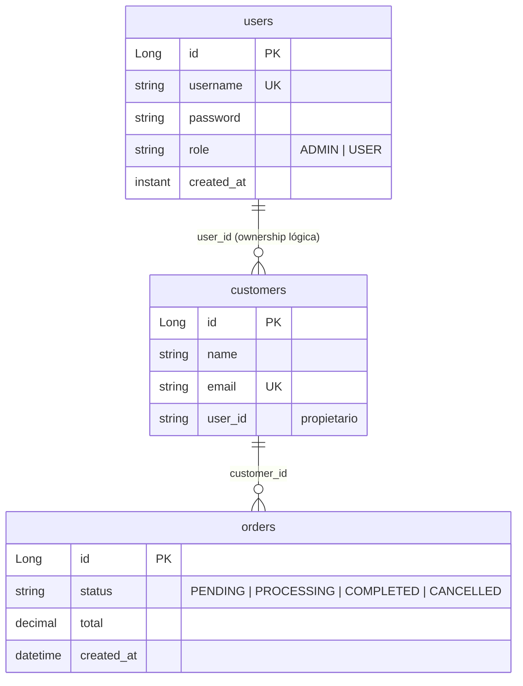

# OMS — Backend

Backend del **Order Management System**, una API REST para gestión de órdenes, clientes y usuarios construida con Spring Boot 3.2 y Java 17.

## Stack

| Capa | Tecnología |
|------|-----------|
| Framework | Spring Boot 3.2.5 |
| Lenguaje | Java 17 |
| Base de datos | PostgreSQL 15+ (dev), H2 (tests) |
| ORM | Spring Data JPA + Hibernate |
| Auth | JWT (jjwt 0.12.3) + Spring Security |
| Validación | Jakarta Bean Validation |
| Tests | JUnit 5 + Mockito + Spring Security Test + ArchUnit |
| Build | Maven (Wrapped: `./mvnw`) |

---

## Arquitectura: Hexagonal (Puertos y Adaptadores)

El proyecto sigue una arquitectura hexagonal limpia con tres capas principales. La dependencia fluye **siempre hacia adentro**: el dominio no sabe nada del exterior.

```
┌─────────────────────────────────────────────────────────────┐
│                     INFRASTRUCTURE                          │
│  Controllers · JPA Repositories · Security Filters · DTOs  │
│  Mappers · JPA Entities · Specifications                    │
│                                                             │
│  Depende → Application → Domain                             │
└─────────────────────────────────────────────────────────────┘
         ▲                                                    │
         │                                                    │
         │  Implementa interfaces (puertos de salida)         │
         │                                                    │
┌────────┴────────────────────────────────────────────────────┘
│                     APPLICATION                              │
│  OrderService · CustomerService · UserService               │
│                                                             │
│  Orquesta casos de uso. Depende de puertos (interfaces).    │
│  No conoce infraestructura ni frameworks.                   │
└─────────────────────────────────────────────────────────────┘
         ▲                                                    │
         │                                                    │
         │  Define puertos (interfaces)                       │
         │                                                    │
┌────────┴────────────────────────────────────────────────────┘
│                     DOMAIN                                   │
│  Order · Customer · User · OrderStatus · Role               │
│  OrderRepository (port) · CustomerRepository (port)         │
│  UserRepository (port) · OrderFilter (port)                 │
│  InvalidStatusTransitionException · DuplicateEmailException │
│  DuplicateUsernameException                                  │
│                                                             │
│  CERO dependencias externas. Modelos PLANOS (POJOs).        │
│  Contiene la lógica de negocio pura.                        │
└─────────────────────────────────────────────────────────────┘
```

### Capa de Dominio (`com.oms.domain`)

Modelos de negocio puros, sin anotaciones de framework, sin dependencias externas.

- **`model/`** — `Order`, `Customer`, `User`, `OrderStatus`, `Role`
  - `Order.transitionTo()` contiene la máquina de estados (PENDING → PROCESSING → COMPLETED | CANCELLED)
  - Métodos estáticos `create()` y `rehydrate()` para separar creación de nueva entidad vs. reconstrucción desde BD
- **`port/`** — Interfaces que definen contratos con el mundo exterior: `OrderRepository`, `CustomerRepository`, `UserRepository`, `OrderFilter` (record para filtrado dinámico)
- **`exception/`** — Excepciones de dominio: `InvalidStatusTransitionException`, `DuplicateEmailException`, `DuplicateUsernameException`

### Capa de Aplicación (`com.oms.application`)

Orquesta casos de uso. Depende exclusivamente de puertos (interfaces), nunca de implementaciones concretas.

- **`service/`** — `OrderService`, `CustomerService`, `UserService`
  - Cada servicio recibe su repositorio por inyección de dependencias contra la interfaz del puerto
  - Contiene validaciones de negocio coordinadas (ej: `OrderService.createOrder()` verifica que el customer exista antes de crear la orden)

### Capa de Infraestructura (`com.oms.infrastructure`)

Implementaciones técnicas concretas. Es la única capa que conoce Spring, JPA, bases de datos, HTTP, JWT.

- **`persistence/entity/`** — Entidades JPA (`UserJpaEntity`, `CustomerJpaEntity`, `OrderJpaEntity`) separadas de los modelos de dominio
- **`persistence/repository/`** — Spring Data JPA repositories (`UserJpaRepository`, `CustomerJpaRepository`, `OrderJpaRepository`)
- **`persistence/mapper/`** — Mapeo entre entidades JPA y modelos de dominio (`UserMapper`, `CustomerMapper`, `OrderMapper`)
- **`persistence/specification/`** — `OrderSpecification`: construcción dinámica de consultas JPA Criteria a partir del filtro de dominio
- **`persistence/*Adapter.java`** — Implementaciones concretas de los puertos de repositorio. Traducen entre el lenguaje del dominio y el lenguaje de JPA
- **`security/`** — `JwtService` (generación/validación de tokens), `JwtAuthenticationFilter` (filtro OncePerRequestFilter), `UserDetailsServiceImpl` (puente con Spring Security)
- **`web/controller/`** — Controladores REST (`AuthController`, `OrderController`, `CustomerController`, `UserController`, `DashboardController`, `GlobalExceptionHandler`)
- **`web/dto/`** — DTOs de request/response
- **`web/mapper/`** — Mapeo entre modelos de dominio y DTOs

### Capa de Configuración (`com.oms.config`)

- `SecurityConfig` — Security filter chain, roles, CORS, autenticación stateless JWT
- `JwtProperties` — Configuración JWT (secret, expiración) vía `@ConfigurationProperties`
- `WebMvcConfig` — CORS (permitido desde `http://localhost:4200`)
- `DevDataSeeder` — Seed de datos iniciales para desarrollo (admin, customers de ejemplo, órdenes)

---

## Principios Aplicados

| Principio | Cómo se aplica |
|-----------|---------------|
| **Single Responsibility** | Cada clase tiene una única razón de cambio. Controladores no hacen lógica de negocio; servicios no saben de HTTP. |
| **Dependency Inversion** | Capa de dominio define interfaces (puertos); infraestructura las implementa (adaptadores). La inyección de dependencias va contra interfaces. |
| **Separation of Concerns** | DTOs de API vs. entidades JPA vs. modelos de dominio. Cada uno con su propósito y ciclo de vida. |
| **Aggregate Root** | `Order` es raíz de agregado con `OrderStatus` como value object integrado. `Order.transitionTo()` encapsula las reglas de cambio de estado. |
| **Unit Testing** | Pruebas de dominio sin Spring. Pruebas de servicio con repositorios mockeados. Pruebas de integración con H2. |
| **Architecture Enforcement** | ArchUnit verifica que dominio NO dependa de infraestructura, que NO use anotaciones JPA, y que los mappers NO sean beans de Spring. |

---

## API REST

| Endpoint | Método | Auth | Rol | Descripción |
|----------|--------|------|-----|-------------|
| `/api/auth/login` | POST | No | — | Login, devuelve JWT |
| `/api/orders` | GET | Sí | USER/ADMIN | Listar órdenes (USER ve solo las suyas) |
| `/api/orders/{id}` | GET | Sí | USER/ADMIN | Obtener orden por ID |
| `/api/orders` | POST | Sí | USER/ADMIN | Crear orden |
| `/api/orders/{id}` | PUT | Sí | USER/ADMIN | Actualizar total o estado de orden |
| `/api/orders/{id}` | DELETE | Sí | ADMIN | Eliminar orden |
| `/api/customers` | GET | Sí | USER/ADMIN | Listar clientes |
| `/api/customers/{id}` | GET | Sí | USER/ADMIN | Obtener cliente |
| `/api/customers` | POST | Sí | USER/ADMIN | Crear cliente |
| `/api/customers/{id}` | PUT | Sí | USER/ADMIN | Actualizar cliente |
| `/api/users` | GET/POST | Sí | ADMIN | CRUD de usuarios |
| `/api/users/{id}` | GET/PUT/DELETE | Sí | ADMIN | CRUD de usuarios |
| `/api/dashboard/stats` | GET | Sí | USER/ADMIN | Estadísticas globales |

---

## Modelo de Datos



---

## Testing

```bash
./mvnw test                          # Todos los tests
./mvnw test -Dtest=OrderServiceTest  # Test específico
```

| Tipo | Descripción |
|------|-------------|
| **Unitarios de dominio** | `OrderDomainTest` — prueba la máquina de estados sin Spring |
| **Unitarios de servicio** | `OrderServiceTest`, `CustomerServiceTest`, `UserServiceTest` |
| **Integración de adaptadores** | `OrderRepositoryAdapterTest`, `CustomerRepositoryAdapterTest`, `UserRepositoryAdapterTest` con H2 |
| **Integración de controladores** | `OrderControllerTest`, `CustomerControllerTest`, `UserControllerTest`, `AuthControllerTest`, `DashboardControllerTest` con `@WebMvcTest` y MockMvc |
| **Seguridad** | `OrderControllerSecurityTest`, `CustomerControllerSecurityTest`, `DashboardControllerSecurityTest`, `UserControllerSecurityTest` |
| **Seguridad JWT** | `JwtServiceTest`, `JwtAuthenticationFilterTest` |
| **Arquitectura** | `ArchitectureTest` — ArchUnit verifica reglas de capas |

---

## Entorno de Desarrollo

### Prerrequisitos

- Java 17+
- PostgreSQL 15+ con base de datos `oms_dev` creada

```bash
createdb oms_dev
```

### Variables de Entorno

| Variable | Defecto | Requerida |
|----------|---------|-----------|
| `DB_USER` | `postgres` | Sí |
| `DB_PASSWORD` | `postgres` | Sí |
| `JWT_SECRET` | `dev-secret-change-in-production` | Sí |

### Ejecución

```bash
./mvnw spring-boot:run
```

La aplicación arranca en `http://localhost:8080` con datos semilla (dev profile):
- **Admin**: `admin` / `admin123`
- **Customers**: Alice Smith, Bob Jones, Carol White
- **Orders**: 2 órdenes de ejemplo

---

## Perfiles

- **`dev`** (activo por defecto) — PostgreSQL, `ddl-auto: update`, SQL logging
- **`test`** — H2 en modo PostgreSQL, `ddl-auto: create-drop`
